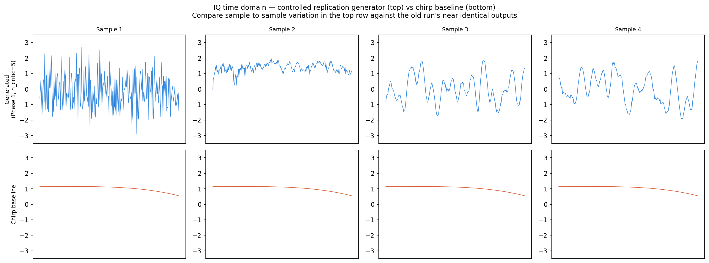
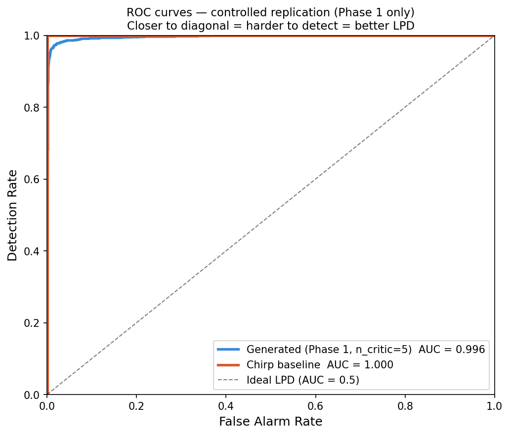
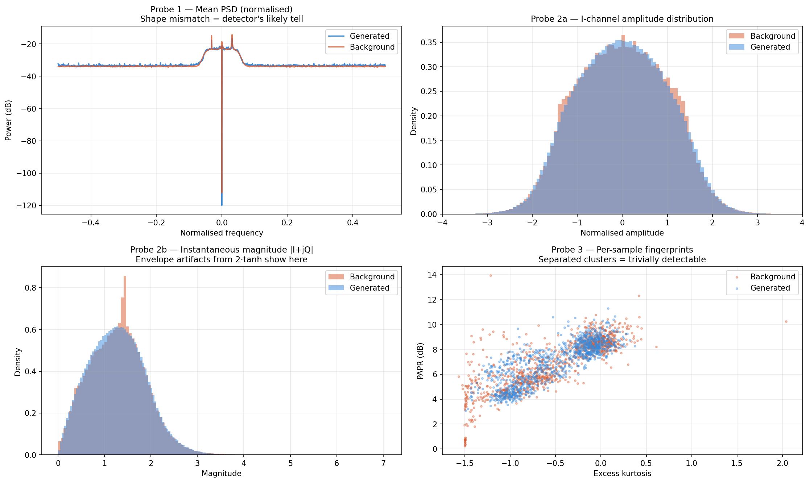
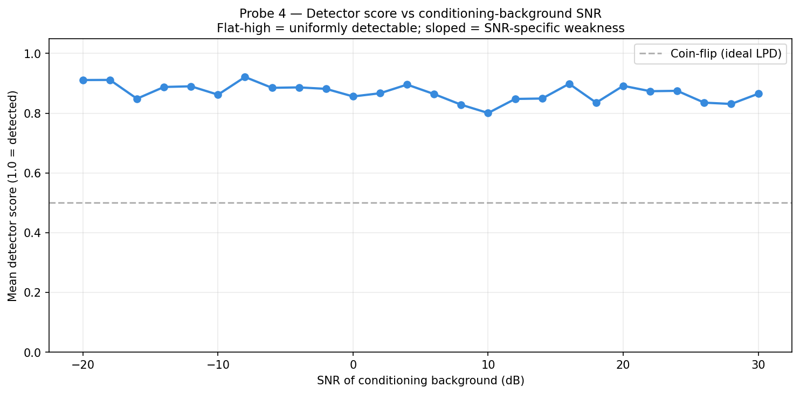
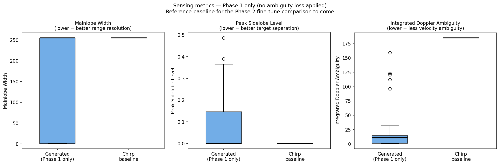

# AI-Driven Adaptive Waveform Design for UAV Radars


M.Tech thesis project · Rajiv Gandhi Institute of Petroleum Technology · IDD CSE & AI, Batch 2022

> Built on: Ziemann & Metzler, *"Adaptive LPD Radar Waveform Design with Generative Deep Learning"*, [arXiv:2403.12254](https://arxiv.org/abs/2403.12254) (2024)

---

## Key Finding

> **Mode collapse and detectability are separable failure modes.**
> A generator can be fully diverse — matching the background's internal variety almost exactly — and still be near-perfectly detected by a neural adversary. Fixing one problem does not fix the other.

| | Diversity (std ratio) | Detector AUC |
|---|:---:|:---:|
| Reduced-parameter run (mode-collapsed) | 1.374 | 1.0000 |
| Controlled replication (fully diverse) | **1.005** | **0.9958** |

Full diversity, essentially unchanged detectability. See [Results](#results) for the four-probe diagnostic that rules out the obvious explanations.

<p align="center">
  
  <br>
  <sub><i>Generated waveforms vs chirp baseline, IQ time-domain</i></sub>
</p>

---

## Table of Contents

- [Overview](#overview)
- [Repository Structure](#repository-structure)
- [The Dataset](#the-dataset)
- [Methodology](#methodology)
- [Results](#results)
- [Getting Started](#getting-started)
- [Notebook Guide](#notebook-guide)
- [Contributions](#contributions)
- [Roadmap](#roadmap)
- [Citation](#citation)
- [Acknowledgments](#acknowledgments)
- [License](#license)

---

## Overview

Radar systems must transmit to sense — but every transmission is also an announcement to anyone listening. Low-probability-of-detection (LPD) waveform design addresses this by shaping the emitted signal to resist identification by an intercept receiver, while still performing useful sensing.

This project replicates a recent distributional approach to LPD design: train a conditional Wasserstein GAN (cWGAN-GP) to produce radar waveforms that are statistically indistinguishable from the ambient RF background, conditioned on a live measurement of that background. A differentiable ambiguity-function loss shapes the waveform's sensing quality alongside the adversarial objective.

Rather than proposing a new architecture immediately, this work first asks a more basic question: **does the published method actually deliver what it claims, under careful evaluation?** That question surfaced a dataset flaw, a training instability, and ultimately a genuine empirical finding about the limits of distribution-matching as an LPD strategy.

---

## Repository Structure

```
lpd-radar-waveform/
├── src/
│   ├── __init__.py
│   ├── dataset.py          # Stratified data loading, caching, normalisation
│   ├── models.py            # Generator / Critic (1D ResNeXt) architectures
│   └── ambiguity.py         # Differentiable ambiguity function + loss
├── notebooks/
│   ├── 01_eda.ipynb                    # Dataset exploration
│   ├── 02_data_pipeline.ipynb          # Stratified split, caching pipeline
│   ├── 03_ambiguity_function.ipynb     # Ambiguity function implementation + verification
│   ├── 04_models.ipynb                 # Generator / Critic architecture build
│   ├── 05_train_gan.ipynb              # Initial training run (reduced params)
│   ├── 05.1_train_gan.ipynb            # Controlled replication run (paper-spec params)
│   └── 06.1_evaluate_gan.ipynb         # Controlled evaluation + 4-probe diagnostic
├── assets/
│   └── figures/              # Generated figures
├── requirements.txt
├── LICENSE
└── README.md
```

---

## The Dataset

**[RadioML 2018.01A](https://www.deepsig.ai/datasets/)** (O'Shea et al., 2018) — a public corpus of over-the-air radio recordings, used here to model the ambient RF background.

| Property | Value |
|---|---|
| Total recordings | 2,555,904 |
| Recording shape | 1,024 IQ time samples (2 channels) |
| Modulation classes | 24 (OOK, ASK, PSK, APSK, QAM, AM, FM, GMSK, OQPSK families) |
| SNR levels | 26 (−20 dB to +30 dB, 2 dB steps) |
| Recordings per (class, SNR) cell | 4,096 |

### A structural flaw we identified and corrected

The source file is sorted by modulation class, then by SNR. A naive fifty-percent index split — used in the original paper's evaluation setup — is therefore **class-disjoint**: the first half contains only classes 0–11, the second half only classes 12–23. A generator trained on this split never observes half the modulation families it is evaluated against.

**Fix:** `src/dataset.py` implements a stratified split — for every (class, SNR) cell, half the samples go to each partition — so both the generator and the evaluation detector see all 24 classes and all 26 SNR levels.

---

## Methodology

- **Conditional Wasserstein GAN with Gradient Penalty (cWGAN-GP).** Generator and critic are both conditioned on a live background sample, so the generator learns to imitate whatever is currently on the air rather than a fixed average distribution.
- **1D ResNeXt architecture** for both networks. Generator: 10.34M parameters (≈85% of the paper's 12.2M). Critic: 9.72M parameters (≈83% of the paper's 11.7M).
- **Differentiable ambiguity-function loss**, computed via FFT-based lag products, verified to supply a non-vanishing gradient (norm ≈1.18×10⁷ on a test batch).
- **Live diversity instrumentation** (this project's addition) — two metrics computed every training epoch on a fixed monitoring batch:
  - `std_ratio` — background-to-generated per-sample standard deviation ratio (healthy ≈ 1.0)
  - `cos_gap` — generated minus background intra-batch cosine similarity (healthy ≈ 0.0)

  This exists because the baseline training objective contains no explicit diversity term — mode collapse can occur silently and would otherwise only be visible at final evaluation.

---

## Results

Two training runs are compared. Full details in `notebooks/05_train_gan.ipynb` / `05.1_train_gan.ipynb` and their corresponding evaluation notebooks.

### Run comparison

| Setting | Reduced-parameter run | Controlled replication |
|---|:---:|:---:|
| Critic updates per generator update | 2 | 5 (paper spec) |
| Samples per (class, SNR) cell | 1,024 | 2,048 |
| Phase 1 epochs | 40 | 70 (converged) |
| Diversity monitoring | none | every epoch |
| **std_ratio** | 1.374 | **1.005** |
| **Intra-class similarity vs. background** | ≈14× | **≈1×** |
| **Detector AUC** | 1.0000 | **0.9958** |

### The four-probe diagnostic

Ruling out simple explanations for the controlled run's residual detectability:

| Probe | Result |
|---|---|
| Power spectral density | Symmetric KL divergence = 0.0345 bits — spectra effectively match |
| Amplitude / magnitude distributions | Overlap closely, no separable shift |
| Kurtosis / peak-to-average power | Gen: −0.501 / 7.00 dB · Background: −0.513 / 6.91 dB — statistically indistinguishable |
| Detector confidence vs. conditioning SNR | Flat (0.80–0.92) across the full −20 to +30 dB range — no regime dependence |

**Conclusion:** none of the low-order statistics explain the residual detectability. The detector appears to exploit higher-order temporal structure that these measures do not capture.

<p align="center">
  
  &nbsp;&nbsp;
  
  <br>
  <sub><i>ROC curves (left) and the four-probe diagnostic (right)</i></sub>
</p>

<p align="center">
  
  <br>
  <sub><i>Detector confidence vs. conditioning-background SNR — flat across the full range, ruling out an SNR-specific weakness</i></sub>
</p>

### Sensing quality (unconstrained baseline)

The controlled-run generator was trained on the adversarial objective alone (no ambiguity loss yet applied). Even so:

| Metric | Generated | Chirp reference |
|---|:---:|:---:|
| Mainlobe width | 255.0 | 255.0 |
| Peak sidelobe level | 0.000 | 0.000 |
| **Integrated Doppler ambiguity** | **10.79** | 184.95 |

≈17× lower Doppler ambiguity than a conventional chirp, without any sensing-specific training pressure.

<p align="center">
  
  <br>
  <sub><i>Sensing metrics — generated vs chirp baseline (Phase 1 only, no ambiguity loss applied)</i></sub>
</p>

---

## Getting Started

```bash
git clone https://github.com/glitching-gops/lpd-radar-waveform.git
cd lpd-radar-waveform
pip install -r requirements.txt
```

**Dataset:** download [RadioML 2018.01A](https://www.kaggle.com/datasets/pinxau1000/radioml2018) and place the `.hdf5` file where the notebooks expect it (see `src/dataset.py`).

**Compute:** all experiments were run on a single NVIDIA T4 GPU (Kaggle). Training uses checkpoint-and-resume to accommodate session limits — see the top of each `train_gan` notebook.

**Experiment tracking:** training and evaluation runs log to [Weights & Biases](https://wandb.ai/); set `WANDB_API_KEY` before running the training notebooks.

---

## Notebook Guide

| Notebook | Purpose |
|---|---|
| `01_eda.ipynb` | Dataset structure, IQ format, class/SNR balance, PSD inspection |
| `02_data_pipeline.ipynb` | Stratified split, RAM caching, `DataLoader` construction |
| `03_ambiguity_function.ipynb` | Differentiable ambiguity function, gradient-flow verification |
| `04_models.ipynb` | Generator / Critic architecture definitions and parameter counts |
| `05_train_gan.ipynb` | First full training run — reduced critic ratio, later found to mode-collapse |
| `05.1_train_gan.ipynb` | Controlled replication — paper-spec critic ratio, live diversity monitor |
| `06.1_evaluate_gan.ipynb` | Evaluation of the controlled run + four-probe diagnostic |

---

## Contributions

1. **Methodological correction** — identified that the standard dataset split used in prior GAN-based LPD work is class-disjoint, and corrected it with a stratified partition.
2. **Diagnostic instrumentation** — built live, per-epoch diversity monitoring that surfaces mode collapse during training rather than only at final evaluation.
3. **Empirical finding** — showed that mode collapse and detectability are separable failure modes: a fully diverse, background-matched generator remains near-perfectly detectable, and four independent statistical probes rule out the conventional explanations.

---

## Roadmap

- [x] Baseline replication and dataset-split correction
- [x] Controlled re-training with live diversity instrumentation
- [x] Four-probe detectability diagnostic
- [ ] Phase 2 fine-tuning with the ambiguity loss, on the corrected checkpoint
- [ ] Adversary-adaptive training (RLAIF) — reward the generator against a continuously retrained detector
- [ ] Exploratory track: diffusion-model-based waveform generation (literature survey pending)

---

## Citation

If referencing the baseline method this project replicates:

```bibtex
@article{ziemann2024adaptive,
  title   = {Adaptive LPD Radar Waveform Design with Generative Deep Learning},
  author  = {Ziemann, Matthew R. and Metzler, Christopher A.},
  journal = {arXiv preprint arXiv:2403.12254},
  year    = {2024}
}
```

---

## Acknowledgments

Thesis work supervised by **Dr. Pallabi Saikia** (Dept. of CSE, RGIPT) and **Dr. Vijay Kumar**, Scientist, Research Centre Imarat (RCI), DRDO Hyderabad. Compute resources provided by the Kaggle platform.

---

## License

Distributed under the MIT License. See `LICENSE` for details.